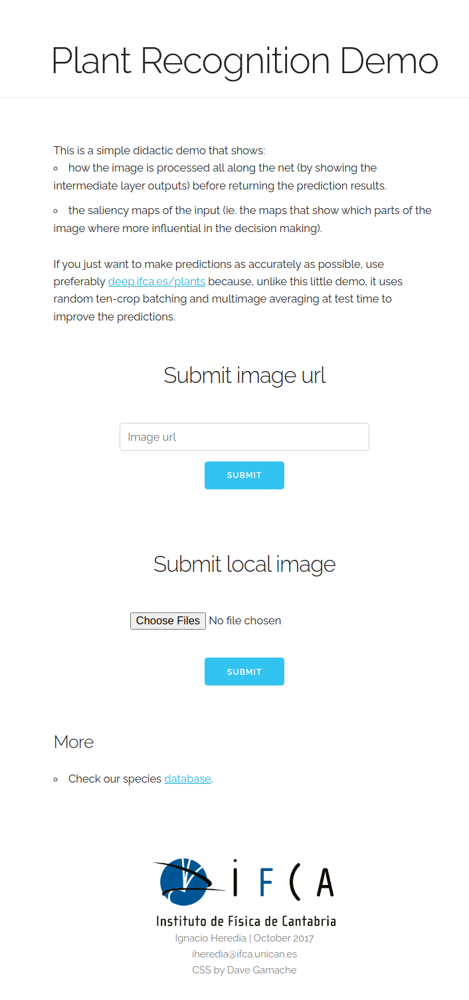

# Didactic demo of plant classification
> **Disclaimer**
> The repo is quite old and doesn't work as is. It has been uploaded for archiving purposes mainly.

**Author** Ignacio Heredia
**Date** October 2017

This is a website to better visualize the predictions of  [plant classification model](https://github.com/IgnacioHeredia/plant_classification) using saliency maps.

